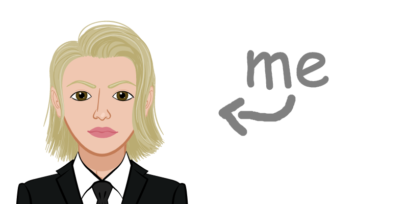

  <h1> Hello devs, I'm Felipe Poter. Welcome to my profile!</h1>

<h1>About Me</h1>

  - <h3>👀 I’m interested in game develop.</h3>
  - <h3>🌱 I’m currently learning programing.</h3>
  - <h3>💻 I'm a beginner programmer.</h3>
<!---
FelipePoter/FelipePoter is a ✨ special ✨ repository because its `README.md` (this file) appears on your GitHub profile.
You can click the Preview link to take a look at your changes.
--->

<h2>🦄 Languages:</h2>

<h2>My Github Stats</h2>

  <a href="https://github.com/FelipePoter">
   
 <a href="https://github.com/FelipePoter"> 

   

  <picture>
    <source
      media="(prefers-color-scheme: dark)"
      srcset="https://raw.githubusercontent.com/platane/snk/output/github-contribution-grid-snake-dark.svg"
    />
    <source
      media="(prefers-color-scheme: light)"
      srcset="https://raw.githubusercontent.com/platane/snk/output/github-contribution-grid-snake.svg"
    />
    
  </picture>
    

